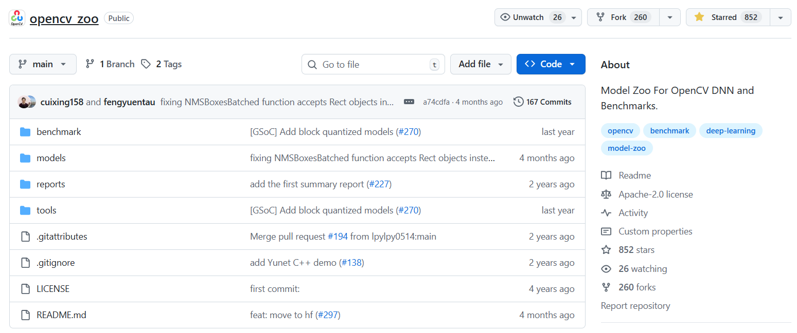
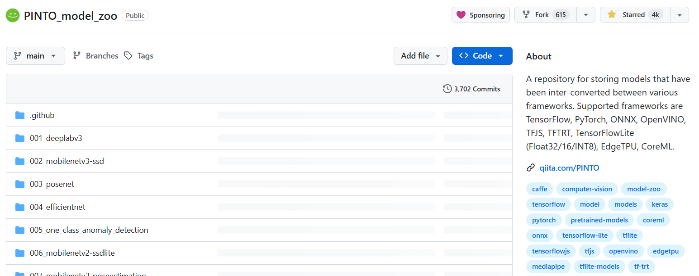

<!-- _class: title -->
<!-- _paginate: false -->
<!-- transition: slide 0.25s -->


# PyScriptでOpenCVを使って<br>Webで画像処理AI<br><br>

Pycon mini 東海（11:35 ～ 12:00）
高橋 かずひと

---

<!-- _class: section05 -->
<!-- _paginate: false -->
<!-- transition: fade 0.25s -->


# <b>Who am I ?</b>

## <br><br><br><b>Name：高橋かずひと</b>
## <b>Work ：画像処理系プログラマ<br>　　　　最近は久々に音声系の処理も</b>
## <b>Other：インディーゲーム開発の<Br>　　　　お手伝いなども</b>
## <Br><b>X　　　：@KzhtTkhs</b>
## <b>GitHub：@Kazuhito00</b>
---

<!-- _class: section06 -->
<!-- _paginate: false -->
<!-- transition: fade 0.25s -->


# <b>Who am I ?</b>

## <Br><br><br><br><br><br><br><br><br><br><br><br><br><b>　　　　　　X　　　：@KzhtTkhs</b>
## <b>　　　　　　GitHub：@Kazuhito00</b>

---

<!-- _class: section08 -->
<!-- _paginate: false -->
<!-- transition: fade 0.25s -->

---

<!-- _class: section10 -->
<!-- _paginate: false -->
<!-- transition: fade 0.3s -->

# PyScriptとは

**<br><br>Webブラウザ上でPythonコードを実行できるフレームワーク**
- Anaconda, Inc. CEO兼共同創設者 Peter Wang氏が<br>PyCon US 2022の基調講演で発表
- 世界で一番普及しているプラットフォーム（Web）で<br>Pythonを手軽に実行できるようにすることが目的
- 現在も開発は続いていて、2～3か月毎の更新があり<br>2025/11/08時点の最新バージョンは `2025.10.3`

---

<!-- _class: section11 -->
<!-- _paginate: false -->
<!-- transition: fade 0.3s -->

# PyScriptとは

**<br><br>PyScript は 2種のインタプリタ (Python ランタイム) をサポート**<br>→ブラウザ上で Wasm ランタイムが起動し、その上で Python <br>　インタプリタが動作（ブラウザ内のサンドボックス環境で動作）

- Pyodide：CPythonをWebAssembly/Emscriptenに移植したもの
- MicroPython：より軽量な Python 実装のWebAssembly版を利用

---

<!-- _class: section12 -->
<!-- _paginate: false -->
<!-- transition: fade 0.3s -->

# PyScriptとは

**<br>**
- Pyodide：CPythonをWebAssembly/Emscriptenに移植したもの<br>→標準の Python／豊富なパッケージ（NumPy、Pandas など）を<Br>　サポートするが、MicroPythonと比較すると少々重い
- MicroPython：より軽量な Python 実装のWebAssembly版を利用<Br>軽量、読み込み・起動が速いが、パッケージ数や標準ライブラリは限定的<br>モバイルやリソース制約のある環境に向く

---

<!-- _class: section12 -->
<!-- _paginate: false -->
<!-- transition: slide 0.3s -->

# PyScriptとは

**<br>外部関数インターフェース（FFI）を用いたブラウザアクセス**
- PythonからDOM操作やWeb API操作が可能
- PythonからJavaScriptへのアクセスだけではなく、<Br>JavaScriptからPythonへのアクセスも可能
- MicroPythonを利用する場合は、Pyodideに比べて制限あり

---

<!-- _class: section13 -->
<!-- _paginate: false -->
<!-- transition: flip 0.4s -->


# デモ：Hello World（HTML単一ファイル）

<br>
<br>

<iframe id="liveframe_demo_01_01"
        style="width:85%; height:77%; border:1px solid #ccc; border-radius:8px;"
        src="demo/demo01-01/initial_page.html"
        sandbox="allow-scripts allow-same-origin">
</iframe>

<br>

<div style="display: flex; gap: 10px; justify-content: center;">
<button onclick="document.getElementById('liveframe_demo_01_01').src='demo/demo01-01/demo.html'" style="padding: 4px 20px; font-size: 16px; cursor: pointer;">
▶️ Run the Demo
</button>
<button onclick="document.getElementById('liveframe_demo_01_01').src='demo/demo01-01/initial_page.html'" style="padding: 4px 20px; font-size: 16px; cursor: pointer;">
🔄 Reset
</button>
</div>
<br>　　　　　　　　　　　　　　PyScript出始めの時に触った方からしたら、書き方が変わっていてちょっと違和感あるかも
<br>　　　　　　　　　　　　　　※たまに破壊的変更があり、latest指定は非推奨（バージョン固定で読み込むことを推奨）

---

<!-- _class: section13 -->
<!-- _paginate: false -->
<!-- transition: slide 0.3s -->


# デモ：Hello World（ファイル分割）

<br>
<br>

<iframe id="liveframe_demo_01_02"
        style="width:85%; height:77%; border:1px solid #ccc; border-radius:8px;"
        src="demo/demo01-02/initial_page.html"
        sandbox="allow-scripts allow-same-origin">
</iframe>

<br>

<div style="display: flex; gap: 10px; justify-content: center;">
<button onclick="document.getElementById('liveframe_demo_01_02').src='demo/demo01-02/demo.html'" style="padding: 4px 20px; font-size: 16px; cursor: pointer;">
▶️ Run the Demo
</button>
<button onclick="document.getElementById('liveframe_demo_01_02').src='demo/demo01-02/initial_page.html'" style="padding: 4px 20px; font-size: 16px; cursor: pointer;">
🔄 Reset
</button>
</div>
<br>　　　　　　　　　　　　　　Hello World以外にも様々な実装例が公開されているので、
<br>　　　　　　　　　　　　　　気になる方は https://docs.pyscript.net/2025.10.3/examples/ を参照ください

---

<!-- _class: section13 -->
<!-- _paginate: false -->
<!-- transition: slide 0.2s -->


# デモ：Tic Tac Toe

<br>
<br>

<iframe id="liveframe_demo_02"
        style="width:85%; height:77%; border:1px solid #ccc; border-radius:8px;"
        src="demo/demo02/initial_page.html"
        sandbox="allow-scripts allow-same-origin">
</iframe>

<br>

<div style="display: flex; gap: 10px; justify-content: center;">
<button onclick="document.getElementById('liveframe_demo_02').src='demo/demo02/demo.html'" style="padding: 4px 20px; font-size: 16px; cursor: pointer;">
▶️ Run the Demo
</button>
<button onclick="document.getElementById('liveframe_demo_02').src='demo/demo02/initial_page.html'" style="padding: 4px 20px; font-size: 16px; cursor: pointer;">
🔄 Reset
</button>
</div>

###### <br>　　　　　　　　　　　　　　参考URL：https://pyscript.com/@examples/tic-tac-toe/latest

---

<!-- _class: section13 -->
<!-- _paginate: false -->
<!-- transition: slide 0.2s -->


# デモ：Folium geographical data

<br>
<br>

<iframe id="liveframe_demo_03"
        style="width:85%; height:77%; border:1px solid #ccc; border-radius:8px;"
        src="demo/demo03/initial_page.html"
        sandbox="allow-scripts allow-same-origin">
</iframe>

<br>

<div style="display: flex; gap: 10px; justify-content: center;">
<button onclick="document.getElementById('liveframe_demo_03').src='demo/demo03/demo.html'" style="padding: 4px 20px; font-size: 16px; cursor: pointer;">
▶️ Run the Demo
</button>
<button onclick="document.getElementById('liveframe_demo_03').src='demo/demo03/initial_page.html'" style="padding: 4px 20px; font-size: 16px; cursor: pointer;">
🔄 Reset
</button>
</div>

###### <br>　　　　　　　　　　　　　　参考URL：https://pyscript.com/@examples/folium/latest

---

<!-- _class: section14 -->
<!-- _paginate: false -->
<!-- transition: slide 0.3s -->

---

<!-- _class: section15 -->
<!-- _paginate: false -->
<!-- transition: slide 0.3s -->


# PythonでAIを用いた画像処理やるには？


**<br>以下のパッケージが使えるとうれしい**

- NumPy（多次元配列と数値演算を扱うライブラリ）
- OpenCV（コンピュータビジョン用ライブラリ）
- Pillow（画像処理用ライブラリ）
- TensorFlow（Google製 機械学習ライブラリ）
- PyTorch（Meta製 機械学習ライブラリ）
- ONNX Runtime（機械学習モデルを共通フォーマットで利用可能なランタイム）

---

<!-- _class: section15 -->
<!-- _paginate: false -->
<!-- transition: slide 0.3s -->

# 対応パッケージ一覧

**<br>PyScript で使えるパッケージは Pyodide 対応のパッケージ**
##### ※厳密にいうと純粋 Python か WASM にビルド済みのパッケージ<br>※MicroPythonは異なるため、本資料では対象外

<br>

<iframe
    style="width:88%; height:65%; border:1px solid #ccc; border-radius:8px;"
    src="https://pyodide.org/en/stable/usage/packages-in-pyodide.html">
</iframe>

###### <br>　　　　　　　　　　　参考URL：https://pyodide.org/en/stable/usage/packages-in-pyodide.html

---

<!-- _class: section15 -->
<!-- _paginate: false -->
<!-- transition: slide 0.3s -->


# PythonでAIを用いた画像処理やるには？


**<br>以下のパッケージが使えるとうれしい**

- ⭕ NumPy（多次元配列と数値演算を扱うライブラリ）
- ⭕ OpenCV（コンピュータビジョン用ライブラリ）
- ⭕ Pillow（画像処理用ライブラリ）
- ❌ ~~TensorFlow（Google製 機械学習ライブラリ）~~
- ❌ ~~PyTorch（Meta製 機械学習ライブラリ）~~
- ❌ ~~ONNX Runtime（機械学習モデルを共通フォーマットで利用可能なランタイム）~~

---

<!-- _class: section15 -->
<!-- _paginate: false -->
<!-- transition: slide 0.3s -->

# 解決案: OpenCV DNNモジュール

## <br>OpenCV DNNモジュールとは

- OpenCVに組み込まれた深層学習推論エンジン

## 特徴

- TensorFlow、PyTorch、Caffeなどのモデルを読み込み可能
- ONNX形式のモデルを読み込み可能
- PyScriptでも利用可能

## 課題
- まだまだ絶賛開発中であり、他ライブラリで動作するモデルが<br>DNNモジュールでは動作しないことが(多々)ある。。。

---

<!-- _class: section13 -->
<!-- _paginate: false -->
<!-- transition: slide 0.3s -->

# OpenCV DNNモジュール使い方概要

<br>

<iframe id="code01"
        style="width:85%; height:100%; border:1px solid #ccc; border-radius:8px;"
        src="demo/code01/initial_page.html"
        sandbox="allow-scripts allow-same-origin">
</iframe>

###### <br>　　　　　　　　　　　参考URL：https://docs.opencv.org/4.11.0/d6/d0f/group__dnn.html

---

<!-- _class: section13 -->
<!-- _paginate: false -->
<!-- transition: slide 0.3s -->

# PyScriptのメディアデバイス取り扱い

<br>

<iframe id="code02"
        style="width:85%; height:100%; border:1px solid #ccc; border-radius:8px;"
        src="demo/code02/initial_page.html"
        sandbox="allow-scripts allow-same-origin">
</iframe>

###### <br>　　　　　　　　　　　参考URL：https://docs.pyscript.net/2025.3.1/user-guide/media

---

<!-- _class: section13 -->
<!-- _paginate: false -->
<!-- transition: slide 0.3s -->


# デモ：YOLOv9-Wholebody28 物体検出

<br>
<br>

<iframe id="liveframe_demo_07"
        style="width:85%; height:77%; border:1px solid #ccc; border-radius:8px;"
        src="demo/demo07/initial_page.html"
        sandbox="allow-scripts allow-same-origin">
</iframe>

<br>

<div style="display: flex; gap: 10px; justify-content: center;">
<button onclick="document.getElementById('liveframe_demo_07').src='demo/demo07/demo.html'" style="padding: 4px 20px; font-size: 16px; cursor: pointer;">
▶️ Run the Demo
</button>
<button onclick="(function(){const iframe=document.getElementById('liveframe_demo_07');try{iframe.contentWindow.stopCamera();}catch(e){}setTimeout(()=>{iframe.src='demo/demo07/initial_page.html';},200);})()" style="padding: 4px 20px; font-size: 16px; cursor: pointer;">
🔄 Reset
</button>
</div>
<br>　　　　　　　　　　　モデル取得元：https://github.com/PINTO0309/PINTO_model_zoo/tree/main/468_YOLOv9-Wholebody28-Refine

---

<!-- _class: section15 -->
<!-- _paginate: false -->
<!-- transition: fade 0.3s -->

# 課題：メモリリーク問題

**<br>今どきのモデルにしては、ちょっと推論遅くねえ？**
##### と思った方、あなたの直感は惜しいです🐤

<Br>推論自体はそんなに遅くないです。
ただ、キャンバスへの反映が数百ms前後かかっており、<br>そこで遅くなっています。

---

<!-- _class: section15 -->
<!-- _paginate: false -->
<!-- transition: fade 0.3s -->

# 課題：メモリリーク問題

##### <br>データコピーは `create_proxy()` を使用すると早いが、<br>メモリリークの問題が解決できず、今回のデモでは代替の遅い処理で妥協

<iframe id="code03"
        style="width:85%; height:82%; border:1px solid #ccc; border-radius:8px;"
        src="demo/code03/initial_page.html"
        sandbox="allow-scripts allow-same-origin">
</iframe>

---

<!-- _class: section15 -->
<!-- _paginate: false -->
<!-- transition: slide 0.3s -->

# 課題：メモリリーク問題

<br>公式ドキュメントのFAQには、以下のような注意喚起がある
- `create_proxy`機能に関して<br>長時間動かす・コールバックを扱うときに、<br>不要になった参照を解放しないとメモリリークが起こり得る
- 「PythonからJS／DOMへの参照」や<br>「JSからPythonへのコールバック」 の構造において<br>不要参照が残存しメモリリークが起こり得る

###### <br>参考URL：https://docs.pyscript.net/2025.10.3/faq/
---

<!-- _class: section16 -->
<!-- _paginate: false -->
<!-- transition: slide 0.3s -->

---

<!-- _class: section15 -->
<!-- _paginate: false -->
<!-- transition: fade 0.3s -->


# まとめ

<br>　

- **PyScriptとは**<br>　Webブラウザ上でのPython実行フレームワーク<br>　PyodideとMicroPythonの2種類をサポート
- **利用可能パッケージ**<br>　利用するインタプリタに依存するため、少々制限あり
- **AI画像処理について**<br>　（Pyodideでは）NumPy、OpenCV、Pillowは利用可能だが<Br>　TensorFlow、PyTorch、ONNXは未対応<Br>　そのため、OpenCV DNNモジュールを利用するなど工夫が必要

---

<!-- _class: section15 -->
<!-- _paginate: false -->
<!-- transition: slide 0.3s -->

# まとめ

<br>　

- **メディアデバイスやデータの取り扱い**<br>　メディアデバイスの取り扱いなど、Python⇔JS、JS⇔Python<br>　相互にデータやAPIのやりとりが可能
- **課題** <br>　相互にデータをやりとりする都合上、大きなデータを利用する場合<br>　メモリリークなどケアが必要な個所もある

<br>**ブラウザでPythonが動いて、GitHub Pagesなどで公開しやすくて面白い<br>※個人の感想です**

---

<!-- _class: section15 -->
<!-- _paginate: false -->
<!-- transition: slide 0.8s -->

# 当日の質疑応答

<br>　

- **Q．PythonのWASIのTierを上げる議論がありましたが、<Br>　　PyScriptで追加が予定されている他のWASMなどはありますか？<br>A．SPyと言う静的型付けのPython風インタプリタが<br>　　研究検討されている模様**
- **Q．Pyodideを利用しています。<br>　　Pyodideと比べた時のPyScriptの推しポイントを教えてください<br>A．Pyodideに比べてHTMLやpyファイルに<br>　　書きやすいように設計されており、ファイル分割などもしやすい**
- **Q．OpenCV DNNモジュールは機械学習推論用のモジュールですか？<br>A．OpenCVに含まれる推論専用のモジュールです。<br>　　　　　他ライブラリ(TensorFlow/PyTorchなど)で<br>　　　　　学習したモデルを読み込みます。**

---

<!-- _class: section17 -->
<!-- _paginate: false -->
<!-- transition: none -->

---

<!-- _class: section10 -->
<!-- _paginate: false -->
<!-- transition: none -->

# 補足資料：Pyodide/MicroPython 切り替え

## <br><br>`<script>` の `type` で指定

```html
<!-- Pyodide で実行 -->
<script type="py">
  print("Hello from Pyodide")
</script>

<!-- MicroPython で実行 -->
<script type="mpy">
  print("Hello from MicroPython")
</script>
```
---

<!-- _class: section10 -->
<!-- _paginate: false -->
<!-- transition: none -->

# 補足資料：想定ユースケース

## <br><br>
- 教育、学習用途
- ホビー・プロトタイプ用途
- デモ、ドキュメンテーションなどの共有用途
- （限定的な）業務用途<br>→ ダラスの犯罪統計ダッシュボードをPyScriptで作成した事例あり<br>　 https://crimede-coder.com/graphs/Dallas_Dashboard
- クライアント（ブラウザ）上でデータ処理を行い、サーバ負荷を下げるという応用案　※Anaconda, Inc.フォーラムに投稿された議論内容

---

<!-- _class: section15 -->
<!-- _paginate: false -->
<!-- transition: none -->

# OpenCV DNNモジュールで動作するモデル

**<br>OpenCV Zoo and Benchmark は安牌**
##### ※OpenCV DNN 用に調整されたモデルを収集しているModel Zoo

<br>



##### <br>　　　　　　　　　　　　　　参考URL：https://github.com/opencv/opencv_zoo

---

<!-- _class: section15 -->
<!-- _paginate: false -->
<!-- transition: none -->

# PINTO model zoo

**<br>PINTO氏が園長をしている動物園(Model Zoo)**
##### 様々なモデルをONNXなどのフォーマットに変換して収録（2025/11/7時点で470のモデル）

<br>



##### <br>　　　　　　　　　　　参考URL：https://github.com/PINTO0309/PINTO_model_zoo